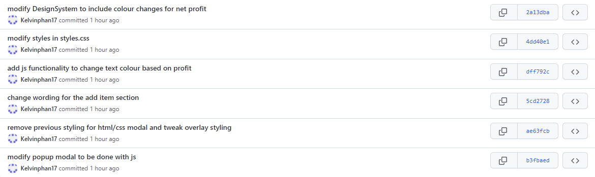
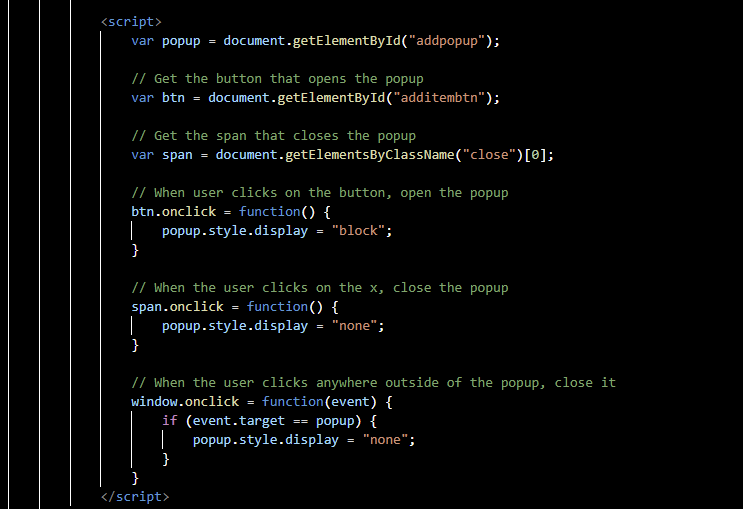
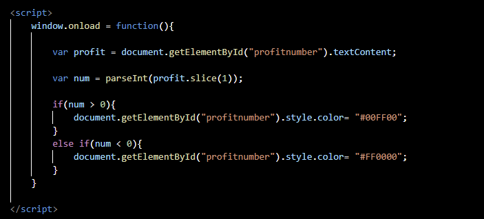
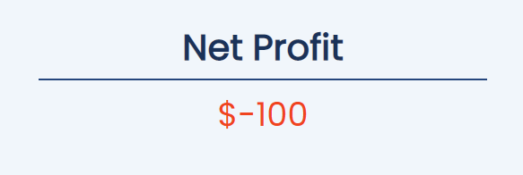
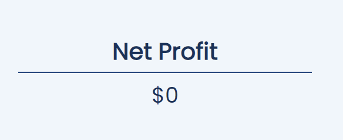

# Deliverable 3

## Deployment Scripts

Included in this project are 2 scripts that will help with deployment. First is ```./bin/db/create.bat```` which creates a PSQL database that <br>
1. Checks to see if the db "subspace" already exists and drops it if it does 
2. Creates the db "subspace" 
3. Imports [schema.sql](../db/schema.sql) into the db and it 
   - Creates a sequence to increment unique ID's
   - Creates an ENUM type to store the item status 
   - Creates a table to store all inventory data 
4. Seeds the database with [seed.sql](../db/seed.sql) which contains sample data

## Refined Design System

Not many changes were made to the look of the web app aside from adding javascript functionality. The only visual change is the change in colour for the net profit depending on 
if the profit is negative, positive or zero. The HTML and CSS were changed to acommodate the addition of Javascript, mainly in regards to the popup modal. The commits include

and the commits can be viewed in detail at https://github.com/professor-forward/project-csi3140_kp/commits/f/deliverable3

## JavaScript

Javascript was added for two functions, the popup window and modifying the element colour.

The popup window is now done purely in javascript and it works by changing the display style of the popup between ```display: none``` and ```display: block``` to change visibility.
The code for the script can be seen in the image below.


The next script changes the colour of the net profit number between red, green and default based on the number shown. This works by grabbing the number displayed on the dashboard
and then changing the ```element.style.color``` to match. The code for the script can be seen in the image below.


Examples of the colour changing based on the number can be seen in the screenshots below.



