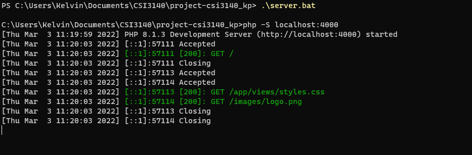
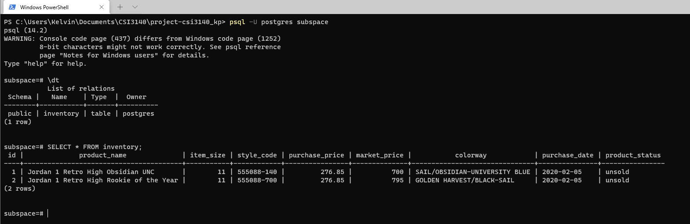
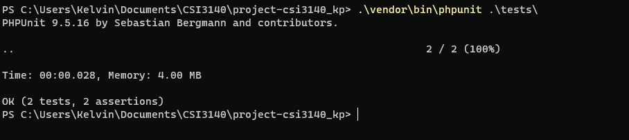

# Deliverable 3

Mark | Description <br>
2.0  | [Server Technology integrated (e.g. PHP, Elixir, Go) including library and frameworks](#server-technology) <br>
2.0  | [Database Technology integrated (e.g. MySQL, Postgres, Redis, etc)](#database-technology) <br>
1.0  | [Automated test framework in place](#test-framework) <br>
2.0  | [Deployment / Upgrade Scripts working](#deployment-scripts) <br>
1.0  | [Refined HTML/CSS + UI Design System](#refined-design-system) <br>
1.0  | [Front-end (mock) interactivity using JavaScript](#javascript) <br>
1.0  | README.md updated with installation / deployment instructions <br>

## Server Technology

The server technology intergrated for Subspace is PHP. The web app was built and tested on PHP's local server. Below is a screenshot of the typical output after starting the
web app locally using ```.\server.bat```.



## Database Technology

Subspace uses the PostgresSQL to store inventory data into a database. To create the db upon deployment, we must call ```./bin/db/create.bat``` which creates a PSQL database that <br>
1. Checks to see if the db "subspace" already exists and drops it if it does 
2. Creates the db "subspace" 
3. Imports [schema.sql](../db/schema.sql) into the db and it 
   - Creates a sequence to increment unique ID's
   - Creates an ENUM type to store the item status 
   - Creates a table to store all inventory data 
4. Seeds the database with [seed.sql](../db/seed.sql) which contains sample data <br>

Using [create.bat](../bin/db/create.bat) the database is created and seeded. A sample output of browsingthe databse using a CLI can be seen in the screenshot below.



## Test Framework

Automatic testing is done with PHPUnit. The tests are run from [TestStats.php](../tests/StatsTest.php) where there are two simple tests, ```testCheckNumOfItems()``` and 
```testCheckNumOfItemsAfterDelete()```. <br>

```testCheckNumOfItems()``` will connect to the DB and add an entry. The test then asserts that the extra entry was added by checking if a row was added into the DB. <br>

```testCheckNumOfItemsAfterDelete()``` will connect to the DB and delete the most recent row in the DB. The test then asserts that there are only 2 rows left (which contains the sample data).<br>

Below is a screenshot of the output of running this test.



## Deployment Scripts

Included in this project are 3 scripts that will help with deployment. 

The first script ```./build.bat``` is a script that will zip all files exlcude .git, composer files (vender, composer.json, composer.lock), info.php, tests into a compress folder named "Subspace". This allows the server to be deployed anywhere as the web app is now compressed into a portable zip file. The script can be found at [build.bat](../build.bat).<br>

The second script ```deploy.bat``` is meant to be clicked when browsing through Subspace.zip. This script will unzip Subspace.zip and place it into the directory ```C:\Subspace``` and then open a file explorer at that location. When using the script the server will be fully deployed and all you need to do is run ```server.bat``` to start the server. The deploy script can be found at [deploy.bat](../deploy.bat). <br>

The last script ```./server.bat``` is a simple script to start a PHP development server on localhost:4000. This script can be found at [server.bat](../server.bat).

## Refined Design System

Not many changes were made to the look of the web app aside from adding javascript functionality. The only visual change is the change in colour for the net profit depending on 
if the profit is negative, positive or zero. The HTML and CSS were changed to acommodate the addition of Javascript, mainly in regards to the popup modal. The commits include

and the commits can be viewed in detail at https://github.com/professor-forward/project-csi3140_kp/commits/f/deliverable3

## JavaScript

Javascript was added for two functions, the popup window and modifying the element colour.

The popup window is now done purely in javascript and it works by changing the display style of the popup between ```display: none``` and ```display: block``` to change visibility.
The code for the script can be seen in the image below.


The next script changes the colour of the net profit number between red, green and default based on the number shown. This works by grabbing the number displayed on the dashboard and then changing the ```element.style.color``` to match. The code for the script can be seen in the image below.


Examples of the colour changing based on the number can be seen in the screenshots below.


