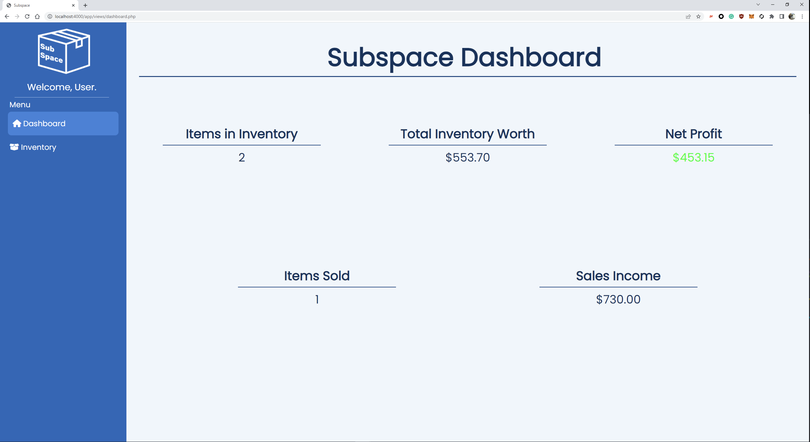

# Deliverable 4

Mark | Description  
3.0 | [Implementation of features Server / Client / HTML / CSS](#implementation-of-features)  
2.0 | [Software Documentation](#software-documentation)  
1.0 | [Adherance to UI Design System](#adherance-to-the-ui-design-system)  
1.0 | [Seeding application with sample data](#seeding-application-with-sample-data)  
1.0 | [Screenshots of available features](#screenshots-of-available-features)  
1.0 | Application v1.0 (quality versus quantity)  
1.0 | Git usage (commit messages, all students involved)  

## Implementation of features

Many features were added for the web app. These features include adding items to the inventory, editing items, deleting items, searching for items, sorting the table and
viewing inventory statistics on the dashboard. To view the implementation of these features please visit the [app subfolder](/app/).

Please see [screenshots of available features](#screenshots-of-available-features) for an example of all available features.

## Software Documentation

To see how to install, seed the db, run tests and start the server, please visit the [README](../README.md#Installation).

Subspace was developped in a windows environment so a windows machine will be needed for continuos development. After installing the web application and seeding the database, any features can now be added and tested using the built-in php server.

## Adherance to the UI Design System

The [UI Design system](UIDesignSystem.md) was updated to accomodate for the changes done during deliverable 4. To view the commit log of the changes please visit [here](https://github.com/professor-forward/project-csi3140_kp/commit/fd223ccd311674a862ba30890b279d678b9e708a). 

## Seeding application with sample data

Sample data is seeded into the application using a simple script called [create.bat](../bin/db/create.bat) which creates the database using the [schema](../db/schema.sql) and the [seed](../db/seed.sql) which contains some sample data. To view how to execute this script, please visit [here](../README.md#seeding-the-database).

## Screenshots of available features

To view a video demonstration of the features of Subspace, please visit [here](https://vimeo.com/695775651).

All avaiable features are documented in the screenshots below.

Viewing the dashboard and the data about the inventory with provided sample data. All fields are calculated using data from the database.

Viewing the inventory page that includes the inventory table.

The process of adding an item to the database is seen below. The first image shows the add item form and the second image shows the resulting addition to the table.  
 

The process of editing and updating an entry in the database is seen below. The first image shows the edit item form that is populated with db data, the second image shows the edit form after making changes and the third image shows the resulting addition to the table.
  

Searching for an item in your inventory is done by product name. This can be done by typing in the search box. After every keystroke the table will update with relevant data. A resulting search can be seen in the image below.

The inventory table can be sorted. By default the table is sorted by entry ids but it can be sorted through product name, size, item status, purchase total, market price, sold price, profit and date purchased. Below is a screenshot of sorting the table by product name in ascending order.

Deleting an item from the database is done by clicking the delete icon for the respective entry in the table. The first image shows the prompt that is displayed when clicking the delete button and the second image shows the resulting table after the delete operation.
 
