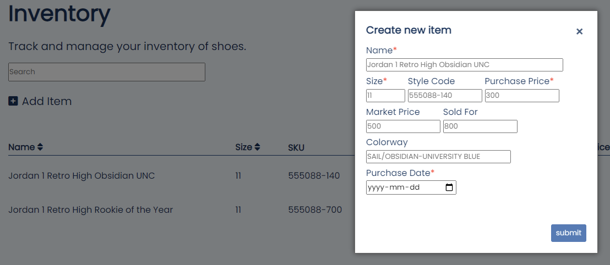

# UI Design System

This document describes and sets a guideline that communicates the design of the Subspace inventory system.

Here are the requirements that must be fulfilled for the design and mockups.

Mark | Description  
3.0  | [Mock-Ups in HTML / CSS](#mock-ups-in-html--css)  
1.0  | [Colour Palette](#colour-palette) 
1.0  | [Fonts and Type Scale](#fonts-and-type-scale) 
1.0  | [Icons (and other images)](#icons-and-other-images) 
1.0  | [Buttons and Form Elements](#buttons-form-elements-and-components) 
1.0  | [Components (e.g. popups)](#buttons-form-elements-and-components) 
2.0  | Updated README.md to document UI Design System 
1.0  | Git usage (commit messages, all students involved) 

This document will be going through each requirement one by one. 

## Mock-Ups in HTML / CSS

The Mock-Ups made for both the dashboard page and inventory page can be found in [dashboard.html](../dashboard.html) and [inventory.html](../inventory.html) respectively. They are both styled with the same css file in [styles.css](../styles.css).

Below are a screenshots of the view of each page with sample data.

## Colour Palette

The colour palette used in the design of Subspace is mostly monochrome which pivots around the main colour,  `#236AB9`. Within the sidebar the text is just simply white `#fff` with it's accents being  `#9dc2ec`. Within the sidebar interaction, when hovering one of the element of the menu the colour will change to  `#6ca4e3` and when you are active on the specified page, the menu element will change to  `#3c85da`.

The main content view of each of the pages features a background colour of  `#f0f6fc`. All the text for the main content view on all pages will be  `#12345c`, while border accents are coloured  `#194981`.

All buttons are styled at opacity 0.8 until hovered and coloured  `#205ea6` with it's inner text colour being  `#f0f6fc`.

## Fonts and Type Scale

The main font used for subspace is https://fonts.google.com/specimen/Poppins. 

The type scale of all the text uses rem units so that the text will be sized relative to the browser font sizing. 

On the sidebar the welcome message is 1.8rem while all menu elements are 1.5rem.

On the dashboard page, the main header is 5rem while all subheaders are 2.5rem with their content being 2.3rem

On the inventory page the main header is 2.5rem while all subsequent text is half the size at 1.25rem. Within the inventory table, all text is sized at 1rem.

## Icons and other images

All icons were imported from https://fontawesome.com/. 

The subspace logo was handmade using adobe illustrator. 

Below is a screenshot which include the three icons taken from font awesome (home, inventory and plus) and the subspace logo desgined using adobe illustrator.

## Buttons, Form Elements and Components

Buttons were desined to be of colour  `#205ea6` and were set to opacity 0.8 so that when you hover the opacity will revert back to 1. 
In the case of "Add item" as it is an anchor element with an icon embedded into it and was coloured to be the same colour as text  `#12345c` 

These buttons can be seen in the image below.

  
For the form elements there is a simple search form with a submit and clear button to search through the inventory table pictured below.

To access the add item form, we have to click on the "Add item" anchor which will then create a new div that overlays the current page by setting the background to black with an alpha value of 0.5. Normally, this overlay is hidden but on click of "Add item" the overlay will be set to visible and will physically be at a higher z-index than the rest of the page so it will apper on top. This overlay popup include the add item form and one button and one anchor. The button saves all the elements of the form inputs and the anchor is simply a close button that will set the overlay visibility back to hidden. The full popup view can be seen in the screenshot below.

The add item form element is for inputting data about a new item to be added to the inventory list. This overlay includes the required inputs name, size, purchase price and purchase date, all denoted with a red asterisk. From the required attributes, sizing and purchase price are validated to be of the correct format, i.e sizing cannot be 11.7 and purchase price can't include letter. The rest of the form includes optional inputs which include style code, market price and colorway. Below is a screenshot of the form.

